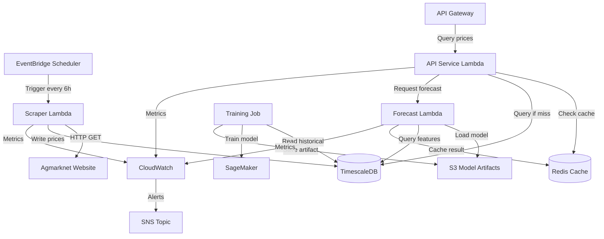

# Design Document: Market Data Pipeline

## Overview

The Market Data Pipeline is a distributed system that provides real-time market intelligence by scraping mandi prices from Agmarknet, storing historical data, and generating ML-based price forecasts. The system consists of five main components:

1. **Scraper Service**: Python-based web scraper using BeautifulSoup to extract price data from Agmarknet
2. **Data Store**: PostgreSQL with TimescaleDB extension for time-series price storage
3. **Forecasting Service**: LightGBM model trained on SageMaker, deployed as Lambda function with model artifact
4. **Cache Layer**: Redis for frequently accessed prices and forecasts (1-hour TTL)
5. **API Service**: REST endpoints for price queries and forecast retrieval

The pipeline runs on a 6-hour schedule via AWS EventBridge, scraping prices for mandis within 100km of configured FPO locations. The forecasting model generates 48-hour predictions with confidence intervals, achieving target MAPE < 15%.

## Architecture

### System Components



### Data Flow

1. **Scraping Flow**: EventBridge triggers Scraper Lambda → Scrapes Agmarknet → Validates and transforms data → Writes to TimescaleDB → Invalidates cache
2. **Query Flow**: Client requests price → API checks Redis → On miss, queries TimescaleDB → Caches result → Returns to client
3. **Forecast Flow**: Client requests forecast → API checks Redis → On miss, invokes Forecast Lambda → Lambda loads model from S3 → Queries features from TimescaleDB → Generates predictions → Caches result → Returns to client
4. **Training Flow**: Manual/scheduled trigger → Training job reads 3 years of data from TimescaleDB → Trains on SageMaker → Evaluates model → Saves artifact to S3 → Updates model version

### Technology Choices

**Scraper**: Python with BeautifulSoup
- Agmarknet has simple HTML structure suitable for BeautifulSoup
- Requests library for HTTP with retry logic
- Lambda execution for serverless scaling

**Storage**: PostgreSQL with TimescaleDB
- TimescaleDB provides time-series optimizations (hypertables, continuous aggregates)
- Native SQL support for complex queries
- Automatic data retention policies
- Better cost-efficiency than AWS Timestream for this scale

**ML Framework**: LightGBM
- Fast training on tabular data
- Handles missing values well
- Small model size suitable for Lambda deployment
- Built-in feature importance for model interpretability

**Inference**: Lambda with model artifact
- Lower cost than SageMaker endpoint for intermittent requests
- Model artifact (~50MB) fits within Lambda limits
- Cold start acceptable for forecast requests (< 3s)

**Cache**: Redis (ElastiCache)
- Sub-millisecond latency for cached queries
- TTL support for automatic expiration
- Pub/sub for cache invalidation

## Components and Interfaces

### Scraper Service

**Responsibilities**:
- Fetch HTML from Agmarknet for configured mandis
- Parse price tables and extract structured data
- Validate and transform scraped data
- Write records to TimescaleDB
- Handle errors and retries

**Interface**:
```python
def scrape_mandi_prices(fpo_location: Location, radius_km: int) -> ScrapeResult:
    """
    Scrapes prices for all mandis within radius of FPO location.
    
    Args:
        fpo_location: Geographic coordinates of FPO
        radius_km: Search radius for mandis (default 100km)
    
    Returns:
        ScrapeResult containing:
        - records_scraped: int
        - records_stored: int
        - errors: List[ScrapeError]
        - duration_seconds: float
    """
    pass

def parse_agmarknet_html(html: str) -> List[PriceRecord]:
    """
    Parses Agmarknet HTML table into structured price records.
    
    Args:
        html: Raw HTML from Agmarknet page
    
    Returns:
        List of PriceRecord objects
    
    Raises:
        ParseError: If HTML structure is invalid
    """
    pass
```

**Error Handling**:
- Network errors: Exponential backoff retry (3 attempts, 2s/4s/8s delays)
- Parse errors: Log error, skip record, continue processing
- Database errors: Fail entire batch, trigger alert

### Data Store Service

**Responsibilities**:
- Store price records in time-series format
- Provide efficient queries by mandi, commodity, date range
- Maintain 3+ years of historical data
- Support model training data extraction

**Schema**:
```sql
-- Hypertable for time-series price data
CREATE TABLE mandi_prices (
    timestamp TIMESTAMPTZ NOT NULL,
    mandi_id VARCHAR(50) NOT NULL,
    commodity_id VARCHAR(50) NOT NULL,
    arrival_quantity DECIMAL(10, 2),
    min_price DECIMAL(10, 2) NOT NULL,
    max_price DECIMAL(10, 2) NOT NULL,
    modal_price DECIMAL(10, 2) NOT NULL,
    scraped_at TIMESTAMPTZ DEFAULT NOW(),
    PRIMARY KEY (timestamp, mandi_id, commodity_id)
);

SELECT create_hypertable('mandi_prices', 'timestamp');

-- Continuous aggregate for daily averages
CREATE MATERIALIZED VIEW daily_price_averages
WITH (timescaledb.continuous) AS
SELECT
    time_bucket('1 day', timestamp) AS day,
    mandi_id,
    commodity_id,
    AVG(modal_price) AS avg_price,
    AVG(arrival_quantity) AS avg_arrival
FROM mandi_prices
GROUP BY day, mandi_id, commodity_id;

-- Indexes for common queries
CREATE INDEX idx_mandi_commodity ON mandi_prices (mandi_id, commodity_id, timestamp DESC);
CREATE INDEX idx_commodity_time ON mandi_prices (commodity_id, timestamp DESC);
```

**Interface**:
```python
def store_price_records(records: List[PriceRecord]) -> int:
    """
    Stores price records in TimescaleDB.
    Uses ON CONFLICT to update duplicates.
    
    Returns:
        Number of records inserted/updated
    """
    pass

def query_prices(
    mandi_id: str,
    commodity_id: str,
    start_date: datetime,
    end_date: datetime
) -> List[PriceRecord]:
    """
    Queries historical prices for mandi-commodity pair.
    Returns records ordered by timestamp descending.
    """
    pass

def get_latest_price(mandi_id: str, commodity_id: str) -> Optional[PriceRecord]:
    """
    Returns most recent price record for mandi-commodity pair.
    Returns None if no data exists.
    """
    pass
```

### Forecasting Service

**Responsibilities**:
- Load trained LightGBM model from S3
- Extract features from historical data
- Generate 48-hour price predictions
- Calculate confidence intervals
- Cache forecast results

**Model Features**:
- Commodity type (categorical)
- Mandi location (categorical)
- Day of week (categorical)
- Month (categorical)
- Season (categorical: Kharif/Rabi/Zaid)
- Lagged prices: t-1, t-7, t-14, t-30 days
- Rolling averages: 7-day, 14-day, 30-day
- Arrival quantity: current, 7-day average
- Regional average price (for missing data handling)

**Interface**:
```python
def generate_forecast(
    mandi_id: str,
    commodity_id: str,
    forecast_hours: int = 48
) -> Forecast:
    """
    Generates price forecast for mandi-commodity pair.
    
    Args:
        mandi_id: Target mandi identifier
        commodity_id: Target commodity identifier
        forecast_hours: Prediction horizon (default 48)
    
    Returns:
        Forecast containing:
        - predictions: List[PricePrediction] (timestamp, price, lower_ci, upper_ci)
        - model_version: str
        - generated_at: datetime
        - mape_validation: float
    """
    pass

def extract_features(
    mandi_id: str,
    commodity_id: str,
    reference_time: datetime
) -> FeatureVector:
    """
    Extracts model features from historical data.
    Handles missing data using regional averages.
    """
    pass

def load_model(model_version: str) -> LGBMRegressor:
    """
    Loads trained model artifact from S3.
    Caches model in Lambda memory for reuse.
    """
    pass
```

**Confidence Intervals**:
- Use quantile regression with LightGBM (alpha=0.1, 0.9 for 80% CI)
- Train three models: median predictor, lower quantile, upper quantile
- Confidence width indicates prediction uncertainty

### Cache Layer

**Responsibilities**:
- Cache recent price queries (1-hour TTL)
- Cache forecast results (1-hour TTL)
- Invalidate cache on new data arrival
- Provide fallback when unavailable

**Interface**:
```python
def get_cached_price(cache_key: str) -> Optional[PriceRecord]:
    """
    Retrieves cached price record.
    Returns None on cache miss or Redis unavailable.
    """
    pass

def set_cached_price(cache_key: str, record: PriceRecord, ttl_seconds: int = 3600):
    """
    Caches price record with TTL.
    Fails silently if Redis unavailable.
    """
    pass

def get_cached_forecast(cache_key: str) -> Optional[Forecast]:
    """
    Retrieves cached forecast.
    Returns None on cache miss or Redis unavailable.
    """
    pass

def invalidate_cache_pattern(pattern: str):
    """
    Invalidates all cache keys matching pattern.
    Used when new data is scraped.
    """
    pass
```

**Cache Key Patterns**:
- Price queries: `price:{mandi_id}:{commodity_id}:latest`
- Historical queries: `price:{mandi_id}:{commodity_id}:{start_date}:{end_date}`
- Forecasts: `forecast:{mandi_id}:{commodity_id}:48h`

### API Service

**Responsibilities**:
- Expose REST endpoints for price queries
- Expose REST endpoints for forecast queries
- Validate request parameters
- Coordinate cache and database access
- Return standardized responses

**Endpoints**:

```
GET /api/v1/prices/current
Query params:
  - mandi_id: string (required)
  - commodity_id: string (required)
Response: PriceRecord with metadata

GET /api/v1/prices/historical
Query params:
  - mandi_id: string (required)
  - commodity_id: string (required)
  - start_date: ISO8601 date (required)
  - end_date: ISO8601 date (required)
Response: List[PriceRecord]

GET /api/v1/prices/forecast
Query params:
  - mandi_id: string (required)
  - commodity_id: string (required)
  - hours: int (default 48, max 168)
Response: Forecast with predictions and confidence intervals

GET /api/v1/mandis
Query params:
  - location: lat,lon (required)
  - radius_km: int (default 100)
Response: List[MandiInfo] with distances
```

**Response Format**:
```json
{
  "status": "success",
  "data": {
    "timestamp": "2024-01-15T10:30:00Z",
    "mandi_id": "delhi_azadpur",
    "commodity_id": "tomato",
    "modal_price": 2500,
    "min_price": 2200,
    "max_price": 2800,
    "arrival_quantity": 150.5,
    "is_stale": false,
    "age_hours": 2
  },
  "metadata": {
    "cached": true,
    "query_time_ms": 15
  }
}
```

## Data Models

### PriceRecord

```python
@dataclass
class PriceRecord:
    timestamp: datetime
    mandi_id: str
    commodity_id: str
    min_price: Decimal
    max_price: Decimal
    modal_price: Decimal
    arrival_quantity: Optional[Decimal]
    scraped_at: datetime
    is_stale: bool = False
    
    def age_hours(self) -> float:
        """Returns age of data in hours"""
        return (datetime.now(timezone.utc) - self.timestamp).total_seconds() / 3600
```

### Forecast

```python
@dataclass
class PricePrediction:
    timestamp: datetime
    predicted_price: Decimal
    lower_ci: Decimal  # 10th percentile
    upper_ci: Decimal  # 90th percentile

@dataclass
class Forecast:
    mandi_id: str
    commodity_id: str
    predictions: List[PricePrediction]
    model_version: str
    generated_at: datetime
    validation_mape: float
    
    def get_prediction_at(self, target_time: datetime) -> Optional[PricePrediction]:
        """Returns prediction closest to target time"""
        pass
```

### ScrapeResult

```python
@dataclass
class ScrapeError:
    mandi_id: str
    error_type: str
    message: str
    timestamp: datetime

@dataclass
class ScrapeResult:
    records_scraped: int
    records_stored: int
    errors: List[ScrapeError]
    duration_seconds: float
    success: bool
    
    def error_rate(self) -> float:
        """Returns percentage of failed scrapes"""
        return len(self.errors) / max(self.records_scraped, 1)
```

### Location

```python
@dataclass
class Location:
    latitude: float
    longitude: float
    
    def distance_km(self, other: Location) -> float:
        """Calculates haversine distance to another location"""
        pass

@dataclass
class MandiInfo:
    mandi_id: str
    name: str
    location: Location
    supported_commodities: List[str]
```


## Correctness Properties

A property is a characteristic or behavior that should hold true across all valid executions of a system—essentially, a formal statement about what the system should do. Properties serve as the bridge between human-readable specifications and machine-verifiable correctness guarantees.

### Property 1: Mandi Radius Filtering

*For any* FPO location and radius configuration, when the scraper retrieves mandi data, all returned mandis should be within the specified radius distance from the FPO location.

**Validates: Requirements 1.1**

### Property 2: Complete Field Extraction

*For any* valid Agmarknet HTML response, the parsed price records should contain all required fields: commodity name, mandi name, arrival quantity (or null), minimum price, maximum price, modal price, and timestamp.

**Validates: Requirements 1.2**

### Property 3: Delayed Data Acceptance

*For any* price record with a timestamp, if the timestamp is between 12 hours in the past and the current time, the scraper should accept and store the record; if the timestamp is more than 12 hours old, the scraper should reject it.

**Validates: Requirements 1.3, 9.2**

### Property 4: Exponential Backoff Retry

*For any* network error or HTTP error response from Agmarknet, the scraper should retry up to 3 times with exponential backoff delays (approximately 2s, 4s, 8s), and log the failure after all retries are exhausted.

**Validates: Requirements 1.4**

### Property 5: Complete Data Persistence

*For any* set of successfully scraped price records, all records should be persisted to the Data_Store with all required fields (timestamp, mandi_id, commodity_id, arrival_quantity, min_price, max_price, modal_price, scraped_at).

**Validates: Requirements 1.5, 3.1**

### Property 6: Alert on Scraping Failure

*For any* scraping job that fails after all retries, the system should emit a failure metric and trigger an alert notification.

**Validates: Requirements 2.4, 10.1**

### Property 7: Query Result Filtering

*For any* historical price query with mandi, commodity, and date range filters, all returned records should match all specified filter criteria, and no matching records should be omitted.

**Validates: Requirements 3.3**

### Property 8: Storage Idempotency

*For any* price record, storing it multiple times with the same timestamp and mandi-commodity combination should result in exactly one record in the Data_Store (updates, not duplicates).

**Validates: Requirements 3.4**

### Property 9: Complete Feature Extraction

*For any* training dataset, the feature extraction process should generate all required features: commodity type, mandi location, season, day of week, arrival quantities, and lagged price values for all records.

**Validates: Requirements 4.2**

### Property 10: Forecast Structure Completeness

*For any* valid mandi-commodity pair, the generated forecast should contain exactly 48 hourly predictions, each with a timestamp, predicted price, lower confidence interval, and upper confidence interval.

**Validates: Requirements 5.1, 5.2**

### Property 11: Confidence Interval Validity

*For any* price prediction in a forecast, the confidence intervals should satisfy: lower_ci ≤ predicted_price ≤ upper_ci.

**Validates: Requirements 5.2**

### Property 12: Recent Data Usage

*For any* forecast generation request, the feature extraction should use the most recent available data from the Data_Store (latest timestamp for the mandi-commodity pair).

**Validates: Requirements 5.3**

### Property 13: Missing Data Fallback

*For any* mandi-commodity pair where recent data is missing (no data in last 48 hours), the feature extraction should use regional average prices as fallback values.

**Validates: Requirements 5.4**

### Property 14: Cache-First Query Pattern

*For any* price query, the API service should check the cache before querying the Data_Store, and only query the database on cache miss or cache unavailability.

**Validates: Requirements 6.1**

### Property 15: Cache TTL Enforcement

*For any* cached price or forecast, the cache entry should expire and be removed after the configured TTL (1 hour).

**Validates: Requirements 6.3**

### Property 16: Cache Invalidation on Update

*For any* new price data stored in the Data_Store, all related cache entries (matching mandi-commodity combination) should be invalidated.

**Validates: Requirements 6.4**

### Property 17: Graceful Cache Degradation

*For any* query when the cache is unavailable or returns an error, the API service should fall back to querying the Data_Store directly and return results successfully.

**Validates: Requirements 6.5**

### Property 18: Current Price Response Completeness

*For any* valid current price query, the API response should include all required fields: timestamp, mandi_id, commodity_id, min_price, max_price, modal_price, arrival_quantity, and metadata (is_stale, age_hours).

**Validates: Requirements 7.1**

### Property 19: Historical Query Ordering

*For any* historical price query, the returned records should be ordered by timestamp in descending order (most recent first).

**Validates: Requirements 7.2**

### Property 20: Multi-Commodity Grouping

*For any* query requesting prices for multiple commodities, the response should group results by commodity_id, with all records for each commodity together.

**Validates: Requirements 7.3**

### Property 21: Service Area Validation

*For any* mandi requested in a query, the API service should validate that the mandi is within the configured service area, and reject requests for mandis outside the area with an appropriate error.

**Validates: Requirements 7.4**

### Property 22: Forecast Response Completeness

*For any* valid forecast query, the API response should include all required fields: mandi_id, commodity_id, predictions list, model_version, generated_at timestamp, and validation_mape.

**Validates: Requirements 8.1, 8.4**

### Property 23: Cached Forecast Retrieval

*For any* forecast query, if a cached forecast exists and is less than 1 hour old, the API should return the cached forecast without invoking the forecaster; if no cached forecast exists or it's expired, the API should generate a new forecast.

**Validates: Requirements 8.2, 8.3**

### Property 24: Partial Failure Resilience

*For any* batch of scraped records where some records have missing fields, the scraper should log the incomplete records, skip them, and continue processing the remaining valid records.

**Validates: Requirements 9.1**

### Property 25: Stale Data Flagging

*For any* price query where the most recent data is older than 24 hours, the API response should set the is_stale flag to true.

**Validates: Requirements 9.3**

### Property 26: Gap Interpolation

*For any* training dataset with missing values in gaps less than 48 hours, the preprocessing should fill the gaps using forward fill interpolation.

**Validates: Requirements 9.4**

### Property 27: Arrival Quantity Imputation

*For any* training record where arrival_quantity is zero or null, the feature extraction should replace it with the historical average arrival for that mandi-commodity-season combination.

**Validates: Requirements 9.5**

### Property 28: Metrics Emission

*For any* completed scraping job (success or failure), the Pipeline_Scheduler should emit metrics including job duration, success/failure status, and number of records processed.

**Validates: Requirements 10.5**

## Error Handling

### Scraper Error Handling

**Network Errors**:
- Implement exponential backoff retry (3 attempts: 2s, 4s, 8s delays)
- Log each retry attempt with error details
- After final failure, emit CloudWatch metric and trigger SNS alert
- Continue with next mandi if one fails (don't fail entire job)

**Parse Errors**:
- Log HTML snippet that failed to parse
- Skip malformed record and continue processing
- Track parse error rate in CloudWatch metrics
- Alert if error rate exceeds 10% of records

**Database Errors**:
- Fail entire batch on database connection errors
- Use database transactions for batch inserts
- Retry transient database errors (connection timeouts)
- Alert on persistent database failures

### API Error Handling

**Invalid Requests**:
- Return 400 Bad Request with descriptive error message
- Validate all required parameters before processing
- Validate date ranges (start < end, not in future)
- Validate mandi/commodity IDs against known values

**Missing Data**:
- Return 404 Not Found for non-existent mandi-commodity pairs
- Return empty array with 200 OK for valid queries with no results
- Include helpful message suggesting nearby mandis or alternative commodities

**Service Errors**:
- Return 503 Service Unavailable if database is down
- Return 500 Internal Server Error for unexpected failures
- Log full error context for debugging
- Include request ID in error responses for tracing

**Timeout Handling**:
- Set 5-second timeout for database queries
- Set 10-second timeout for forecast generation
- Return 504 Gateway Timeout if limits exceeded
- Cache partial results when possible

### Forecasting Error Handling

**Missing Features**:
- Use regional averages for missing recent prices
- Use seasonal averages for missing arrival data
- Log warning when fallback features are used
- Include data quality indicator in forecast metadata

**Model Loading Errors**:
- Cache loaded model in Lambda memory across invocations
- Retry S3 download on transient failures
- Alert if model artifact is corrupted or missing
- Fall back to previous model version if available

**Prediction Errors**:
- Validate input features before prediction
- Catch and log any model inference exceptions
- Return 500 error with message if prediction fails
- Include model version in error logs for debugging

### Cache Error Handling

**Redis Unavailable**:
- Catch all Redis exceptions and log warnings
- Fall back to database queries transparently
- Don't fail requests due to cache unavailability
- Emit metric for cache availability monitoring

**Cache Corruption**:
- Validate cached data structure before returning
- Delete corrupted cache entries
- Fall back to database on validation failure
- Log cache corruption events for investigation

## Testing Strategy

### Unit Testing

Unit tests verify specific examples, edge cases, and error conditions. Focus on:

**Scraper Tests**:
- Parse valid Agmarknet HTML samples
- Handle malformed HTML gracefully
- Validate retry logic with mocked network errors
- Test timestamp validation (accept recent, reject old)
- Test distance calculation for mandi filtering

**Data Store Tests**:
- Test upsert behavior (insert new, update existing)
- Test query filtering by mandi, commodity, date range
- Test edge cases: empty results, single record, large result sets
- Test transaction rollback on errors

**Forecasting Tests**:
- Test feature extraction with complete data
- Test feature extraction with missing data (fallback logic)
- Test confidence interval calculation
- Test forecast caching behavior
- Test model loading and caching

**API Tests**:
- Test request validation (missing params, invalid formats)
- Test cache hit/miss paths
- Test error responses (404, 400, 500)
- Test response format compliance
- Test multi-commodity grouping

### Property-Based Testing

Property tests verify universal properties across all inputs using randomized test data. Each test should run minimum 100 iterations.

**Configuration**: Use Hypothesis (Python) for property-based testing with minimum 100 iterations per test.

**Test Tagging**: Each property test must include a comment tag:
```python
# Feature: market-data-pipeline, Property 1: Mandi Radius Filtering
```

**Property Test Coverage**:
- Property 1: Generate random FPO locations and verify radius filtering
- Property 3: Generate random timestamps and verify acceptance/rejection logic
- Property 4: Test retry behavior with various error types
- Property 5: Generate random price records and verify complete persistence
- Property 7: Generate random query filters and verify result correctness
- Property 8: Test idempotency by storing same record multiple times
- Property 10-11: Generate random forecasts and verify structure and CI validity
- Property 13: Test missing data fallback with various gap scenarios
- Property 14: Test cache-first pattern with random cache states
- Property 16: Test cache invalidation with random data updates
- Property 17: Test graceful degradation with cache failures
- Property 19: Test ordering with random date ranges
- Property 24: Test partial failure handling with mixed valid/invalid records
- Property 25: Test stale flagging with various data ages
- Property 26: Test gap interpolation with random gap patterns
- Property 27: Test arrival imputation with random missing patterns

### Integration Testing

Integration tests verify component interactions:

**End-to-End Scraping**:
- Trigger scraper Lambda with test FPO location
- Verify data appears in TimescaleDB
- Verify cache invalidation occurs
- Verify metrics are emitted

**End-to-End Forecasting**:
- Request forecast via API
- Verify forecast generation and caching
- Verify subsequent request uses cache
- Verify cache expiration after TTL

**Error Recovery**:
- Test scraper behavior when Agmarknet is down
- Test API behavior when database is unavailable
- Test API behavior when Redis is unavailable
- Verify alerts are triggered appropriately

### Performance Testing

**Load Testing**:
- Test API throughput: target 100 req/s for cached queries
- Test API latency: target p95 < 100ms for cached, < 500ms for uncached
- Test scraper performance: target < 5 minutes for 50 mandis
- Test forecast generation: target < 3 seconds per forecast

**Stress Testing**:
- Test database with 3+ years of data (millions of records)
- Test concurrent scraping jobs
- Test API under sustained high load
- Test cache eviction under memory pressure

### Model Validation

**Training Validation**:
- Split data: 80% train, 20% validation
- Target MAPE < 15% on validation set for 48-hour forecasts
- Test on multiple commodities and mandis
- Validate confidence interval calibration (80% of actuals within 80% CI)

**Production Monitoring**:
- Track actual vs predicted prices daily
- Alert if MAPE exceeds 20% over 7-day window
- Retrain model monthly or when accuracy degrades
- A/B test new models before full deployment
