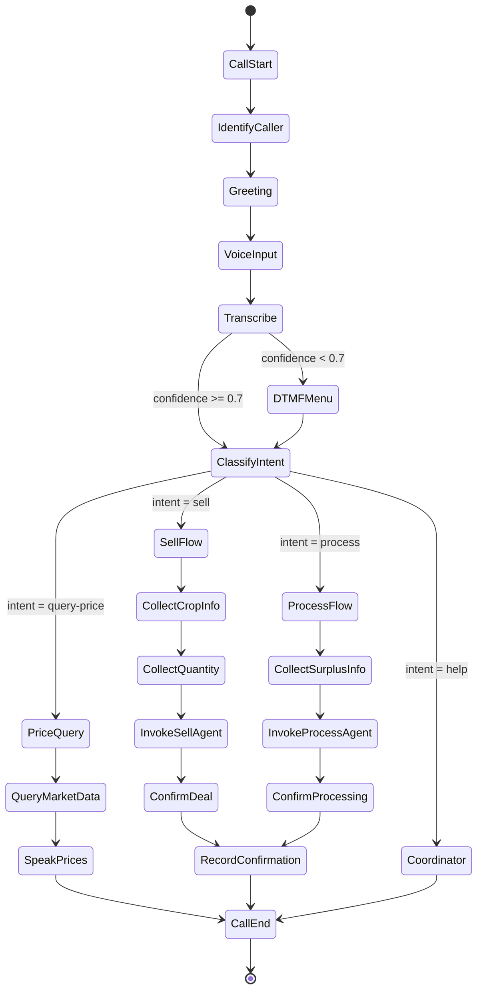

# Design Document: Voice Interface (IVR)

## Overview

The Voice Interface (IVR) provides phone-based access to Anna Drishti for farmers who may have limited literacy or smartphone access. The system enables complete selling and processing workflows via voice commands in Hindi, with DTMF fallback for reliability.

The IVR system is built on Amazon Connect (or Exotel as alternative) for call handling, Amazon Transcribe for Hindi speech-to-text, Amazon Polly (Aditi voice) for text-to-speech, and AWS Lambda for call flow logic. It integrates seamlessly with the existing Sell Agent and Process Agent workflows, maintaining session state in Redis and storing call recordings in S3.

Key design principles:
- Voice-first with DTMF fallback for reliability
- Minimal call duration (< 3 minutes for common flows)
- Stateful sessions with resumability
- Comprehensive audit trail for all confirmations
- Graceful degradation when services fail

## Architecture

### High-Level Architecture

```
┌─────────────────────────────────────────────────────────────────┐
│                    PHONE NETWORK                                 │
│  ┌──────────────┐  ┌────────────────┐  ┌──────────────────┐   │
│  │ Inbound      │  │ Outbound       │  │ SMS Fallback     │   │
│  │ Calls        │  │ Calls          │  │ (Pinpoint)       │   │
│  └──────────────┘  └────────────────┘  └──────────────────┘   │
└──────────────────────────┬──────────────────────────────────────┘
                           │
┌──────────────────────────┴──────────────────────────────────────┐
│              IVR PLATFORM (Amazon Connect)                       │
│                                                                  │
│  ┌────────────────────────────────────────────────────────────┐ │
│  │ Contact Flow:                                              │ │
│  │                                                            │ │
│  │  Answer → Identify Caller → Greeting → Voice/DTMF →       │ │
│  │  Intent Capture → Workflow Integration → Confirmation →   │ │
│  │  Completion                                                │ │
│  └────────────────────────────────────────────────────────────┘ │
│                                                                  │
│  ┌────────────────────────────────────────────────────────────┐ │
│  │ Call Attributes (passed to Lambda):                        │ │
│  │ • Caller phone number                                      │ │
│  │ • Call direction (inbound/outbound)                        │ │
│  │ • Session ID                                               │ │
│  │ • Current step in flow                                     │ │
│  └────────────────────────────────────────────────────────────┘ │
└──────────────────────────┬──────────────────────────────────────┘
                           │
┌──────────────────────────┴──────────────────────────────────────┐
│                   SPEECH PROCESSING                              │
│                                                                  │
│  ┌──────────────────┐  ┌──────────────────┐  ┌──────────────┐ │
│  │ Amazon           │  │ Intent           │  │ Amazon       │ │
│  │ Transcribe       │  │ Classifier       │  │ Polly        │ │
│  │ (Hindi STT)      │  │ (IndicBERT)      │  │ (Aditi TTS)  │ │
│  └──────────────────┘  └──────────────────┘  └──────────────┘ │
└──────────────────────────┬──────────────────────────────────────┘
                           │
┌──────────────────────────┴──────────────────────────────────────┐
│              CALL FLOW ORCHESTRATION (Lambda)                    │
│                                                                  │
│  ┌────────────────────────────────────────────────────────────┐ │
│  │ IVR Handler Functions:                                     │ │
│  │                                                            │ │
│  │  • handle_call_start()                                     │ │
│  │  • handle_voice_input()                                    │ │
│  │  • handle_dtmf_input()                                     │ │
│  │  • handle_intent_routing()                                 │ │
│  │  • handle_confirmation()                                   │ │
│  │  • handle_call_end()                                       │ │
│  └────────────────────────────────────────────────────────────┘ │
│                                                                  │
│  ┌────────────────────────────────────────────────────────────┐ │
│  │ Session State Management:                                  │ │
│  │ • Load session from Redis                                  │ │
│  │ • Update session with new data                             │ │
│  │ • Persist session back to Redis                            │ │
│  │ • Handle session expiry and resumption                     │ │
│  └────────────────────────────────────────────────────────────┘ │
└──────────────────────────┬──────────────────────────────────────┘
                           │
┌──────────────────────────┴──────────────────────────────────────┐
│                  WORKFLOW INTEGRATION                            │
│                                                                  │
│  ┌──────────────────┐  ┌──────────────────┐  ┌──────────────┐ │
│  │ Sell Agent       │  │ Process Agent    │  │ Backend API  │ │
│  │ API              │  │ API              │  │ (FastAPI)    │ │
│  └──────────────────┘  └──────────────────┘  └──────────────┘ │
└──────────────────────────┬──────────────────────────────────────┘
                           │
┌──────────────────────────┴──────────────────────────────────────┐
│                    DATA & STORAGE                                │
│                                                                  │
│  ┌──────────────────┐  ┌──────────────────┐  ┌──────────────┐ │
│  │ Redis            │  │ S3               │  │ PostgreSQL   │ │
│  │ (Sessions)       │  │ (Recordings)     │  │ (Farmers)    │ │
│  └──────────────────┘  └──────────────────┘  └──────────────┘ │
│                                                                  │
│  ┌──────────────────┐  ┌──────────────────┐                    │
│  │ CloudWatch       │  │ DynamoDB         │                    │
│  │ (Logs/Metrics)   │  │ (Call Records)   │                    │
│  └──────────────────┘  └──────────────────┘                    │
└─────────────────────────────────────────────────────────────────┘
```

### Call Flow State Machine



## Components and Interfaces

### 1. Call Handler

**Purpose:** Manage call lifecycle, route to appropriate handlers, and maintain call state.

**Inputs:**
- Call event from Amazon Connect (call start, voice input, DTMF input, call end)
- Caller phone number
- Session ID (if resuming)

**Outputs:**
- Next action for Amazon Connect (play audio, collect input, transfer, hang up)
- Updated session state
- Call log entry

**Implementation:**
- Lambda function triggered by Amazon Connect contact flow
- Load session from Redis using session ID or create new session
- Route to appropriate handler based on call event type
- Update session state after each step
- Return response in Amazon Connect format (JSON)

**Interface:**
```python
class CallHandler:
    def handle_call_start(self, phone_number: str) -> CallResponse:
        """Initialize call session and play greeting"""
        
    def handle_voice_input(self, audio_url: str, session_id: str) -> CallResponse:
        """Process voice input and determine next action"""
        
    def handle_dtmf_input(self, digits: str, session_id: str) -> CallResponse:
        """Process DTMF input and determine next action"""
        
    def handle_call_end(self, session_id: str, reason: str) -> None:
        """Clean up session and log call completion"""
```

### 2. Speech-to-Text Processor

**Purpose:** Transcribe Hindi voice input to text using Amazon Transcribe.

**Inputs:**
- Audio URL (from Amazon Connect)
- Language code (hi-IN)
- Custom vocabulary (agricultural terms)

**Outputs:**
- Transcribed text
- Confidence score (0.0-1.0)
- Alternative transcriptions (if available)

**Implementation:**
- Use Amazon Transcribe streaming API for real-time transcription
- Configure custom vocabulary with crop names, agricultural terms
- Set language to hi-IN (Hindi - India)
- Return transcription with confidence score
- Handle transcription failures gracefully

**Custom Vocabulary:**
- Crop names: टमाटर (tamatar), प्याज (pyaaz), मिर्च (mirch), आलू (aalu)
- Action verbs: बेचना (bechna - sell), तैयार (tayyar - ready), कटाई (kataai - harvest)
- Quantity terms: क्विंटल (quintal), किलो (kilo), टन (ton)

**Interface:**
```python
class SpeechToTextProcessor:
    def transcribe_audio(self, audio_url: str, custom_vocab: List[str] = None) -> TranscriptionResult:
        """Transcribe Hindi audio to text"""
        
    def transcribe_streaming(self, audio_stream: Iterator[bytes]) -> Iterator[TranscriptionResult]:
        """Transcribe audio stream in real-time"""
```

### 3. Intent Classifier

**Purpose:** Classify farmer intent from transcribed text and extract entities.

**Inputs:**
- Transcribed text (Hindi)
- Farmer context (location, previous intents)

**Outputs:**
- Intent type: "sell", "process", "query-price", "query-scheme", "confirm-deal", "help"
- Confidence score (0.0-1.0)
- Extracted entities: crop type, quantity, urgency, location

**Implementation:**
- Option A: Fine-tuned IndicBERT model for intent classification
- Option B: Rule-based pattern matching with keyword detection
- For MVP, use rule-based approach with keyword matching
- Extract entities using regex patterns and custom vocabulary
- Return structured intent with confidence score

**Rule-Based Patterns:**
```python
INTENT_PATTERNS = {
    "sell": ["बेच", "बेचना", "बिक्री", "तैयार", "कटाई"],
    "process": ["प्रोसेस", "प्रसंस्करण", "सुखाना", "पाउडर"],
    "query-price": ["भाव", "रेट", "कीमत", "मंडी"],
    "help": ["मदद", "सहायता", "समझ नहीं आया"]
}

CROP_PATTERNS = {
    "tomato": ["टमाटर", "tamatar"],
    "onion": ["प्याज", "pyaaz"],
    "chili": ["मिर्च", "mirch"],
    "potato": ["आलू", "aalu"]
}
```

**Interface:**
```python
class IntentClassifier:
    def classify_intent(self, text: str, context: FarmerContext) -> IntentResult:
        """Classify intent from transcribed text"""
        
    def extract_entities(self, text: str, intent: str) -> Dict[str, Any]:
        """Extract entities based on intent type"""
```

### 4. Text-to-Speech Generator

**Purpose:** Convert text responses to natural Hindi speech using Amazon Polly.

**Inputs:**
- Text to speak (Hindi or mixed Hindi-English)
- Voice ID (Aditi for Hindi)
- Speech rate (default: medium)

**Outputs:**
- Audio URL (MP3 format)
- Audio duration (seconds)

**Implementation:**
- Use Amazon Polly with Aditi voice (Hindi female voice)
- Support SSML for pauses, emphasis, and pronunciation
- Cache frequently used phrases to reduce latency
- Set speech rate to "medium" for clarity
- Handle mixed Hindi-English text

**SSML Templates:**
```xml
<!-- Price announcement -->
<speak>
    आज का भाव <emphasis level="strong">{price}</emphasis> रुपये प्रति किलो है।
    <break time="500ms"/>
    क्या आप बेचना चाहते हैं?
</speak>

<!-- Deal confirmation -->
<speak>
    आपका सौदा तय हुआ है।
    <break time="300ms"/>
    खरीदार: {buyer_name}
    <break time="300ms"/>
    भाव: <emphasis level="strong">{price}</emphasis> रुपये प्रति किलो
    <break time="300ms"/>
    मात्रा: {quantity} किलो
    <break time="500ms"/>
    क्या आप पक्का करते हैं? हाँ के लिए 1 दबाएं, ना के लिए 2 दबाएं।
</speak>
```

**Interface:**
```python
class TextToSpeechGenerator:
    def generate_speech(self, text: str, use_ssml: bool = False) -> AudioResult:
        """Generate Hindi speech from text"""
        
    def generate_from_template(self, template_name: str, variables: Dict[str, Any]) -> AudioResult:
        """Generate speech from SSML template"""
```

### 5. DTMF Menu Handler

**Purpose:** Provide keypad-based navigation when voice recognition fails or as user preference.

**Inputs:**
- DTMF digits pressed
- Current menu context
- Session state

**Outputs:**
- Next menu to present
- Action to execute
- Audio prompt for next step

**Implementation:**
- Define hierarchical menu structure
- Map DTMF digits to actions
- Support * for back, # for repeat
- Timeout after 10 seconds of no input
- Repeat menu once before transferring to coordinator

**Menu Structure:**
```
Main Menu:
  1 - Sell produce (बेचना)
  2 - Process surplus (प्रोसेस करना)
  3 - Check prices (भाव जानना)
  9 - Talk to coordinator (समन्वयक से बात करें)
  
Sell Menu:
  1 - Tomato (टमाटर)
  2 - Onion (प्याज)
  3 - Chili (मिर्च)
  4 - Potato (आलू)
  * - Back to main menu
  
Quantity Menu:
  [Enter quantity in kg using keypad]
  # - Confirm
  * - Re-enter
```

**Interface:**
```python
class DTMFMenuHandler:
    def get_menu(self, menu_id: str, context: Dict[str, Any]) -> Menu:
        """Get menu definition with prompts"""
        
    def handle_input(self, digits: str, current_menu: str, session: Session) -> MenuResponse:
        """Process DTMF input and determine next action"""
        
    def build_prompt(self, menu: Menu) -> str:
        """Build audio prompt for menu"""
```

### 6. Session Manager

**Purpose:** Maintain conversation state across call steps and enable resumability.

**Inputs:**
- Session ID
- Session data updates

**Outputs:**
- Current session state
- Session expiry status

**Implementation:**
- Store sessions in Redis with 30-minute TTL
- Session key format: `ivr:session:{session_id}`
- Update TTL on each access
- Support concurrent sessions for same farmer (different intents)
- Clean up expired sessions automatically

**Session Schema:**
```python
class IVRSession:
    session_id: str
    farmer_id: str
    phone_number: str
    call_direction: str  # "inbound" | "outbound"
    current_step: str
    intent: Optional[str]
    collected_data: Dict[str, Any]  # crop, quantity, etc.
    voice_confidence_scores: List[float]
    dtmf_fallback_count: int
    workflow_id: Optional[str]  # Sell Agent or Process Agent workflow ID
    created_at: datetime
    updated_at: datetime
    expires_at: datetime
```

**Interface:**
```python
class SessionManager:
    def create_session(self, phone_number: str, call_direction: str) -> IVRSession:
        """Create new IVR session"""
        
    def get_session(self, session_id: str) -> Optional[IVRSession]:
        """Retrieve session from Redis"""
        
    def update_session(self, session_id: str, updates: Dict[str, Any]) -> IVRSession:
        """Update session data and reset TTL"""
        
    def close_session(self, session_id: str) -> None:
        """Mark session as complete and archive"""
```

### 7. Workflow Integrator

**Purpose:** Bridge IVR system with Sell Agent and Process Agent workflows.

**Inputs:**
- Intent and extracted entities
- Farmer ID
- Session ID

**Outputs:**
- Workflow ID (for tracking)
- Workflow status updates
- Actions required from farmer

**Implementation:**
- Call Sell Agent API to initiate selling workflow
- Call Process Agent API to initiate processing workflow
- Poll workflow status for updates
- Translate workflow responses to voice prompts
- Handle workflow callbacks for confirmations

**Integration Points:**
```python
# Sell Agent Integration
POST /api/sell-agent/initiate
{
    "farmer_id": "F123",
    "crop": "tomato",
    "quantity_estimate": 500,
    "urgency": "immediate",
    "source": "ivr",
    "session_id": "ivr-session-456"
}

Response:
{
    "workflow_id": "sell-wf-789",
    "status": "market_scanning",
    "next_action": "wait_for_results"
}

# Process Agent Integration
POST /api/process-agent/initiate
{
    "farmer_id": "F123",
    "crop": "tomato",
    "surplus_quantity": 200,
    "source": "ivr",
    "session_id": "ivr-session-456"
}
```

**Interface:**
```python
class WorkflowIntegrator:
    def initiate_sell_workflow(self, farmer_id: str, intent_data: Dict[str, Any], session_id: str) -> WorkflowResult:
        """Start Sell Agent workflow"""
        
    def initiate_process_workflow(self, farmer_id: str, intent_data: Dict[str, Any], session_id: str) -> WorkflowResult:
        """Start Process Agent workflow"""
        
    def get_workflow_status(self, workflow_id: str) -> WorkflowStatus:
        """Check workflow progress"""
        
    def handle_workflow_callback(self, workflow_id: str, callback_data: Dict[str, Any]) -> CallbackResponse:
        """Process workflow callback (e.g., deal ready for confirmation)"""
```

### 8. Confirmation Handler

**Purpose:** Handle explicit farmer confirmations for deals and critical actions.

**Inputs:**
- Deal details (from Sell Agent)
- Farmer ID
- Session ID

**Outputs:**
- Confirmation status: "confirmed", "declined", "unclear"
- Audio recording reference
- Timestamp

**Implementation:**
- Generate confirmation prompt with all deal details
- Present via TTS in clear Hindi
- Accept voice confirmation ("Haan", "Theek hai") or DTMF (1 for yes, 2 for no)
- Record entire confirmation interaction
- Store audio in S3 with reference in transaction record
- Require explicit affirmative - ambiguous = no confirmation

**Confirmation Flow:**
```
1. Play deal details via TTS
2. Ask: "क्या आप इस सौदे को पक्का करते हैं?"
3. Wait for response (voice or DTMF)
4. If voice: transcribe and check for affirmative keywords
5. If DTMF: 1 = confirm, 2 = decline
6. If unclear: repeat question once
7. If still unclear: fall back to DTMF
8. Record entire interaction
9. Return confirmation result to Sell Agent
```

**Interface:**
```python
class ConfirmationHandler:
    def present_deal(self, deal: Deal, session_id: str) -> str:
        """Generate and play deal confirmation prompt"""
        
    def parse_confirmation_response(self, response: str, response_type: str) -> ConfirmationResult:
        """Parse voice or DTMF confirmation"""
        
    def record_confirmation(self, session_id: str, deal_id: str, result: ConfirmationResult) -> str:
        """Store confirmation audio and create audit record"""
```

### 9. Outbound Call Manager

**Purpose:** Initiate outbound calls for deal confirmations and important notifications.

**Inputs:**
- Farmer phone number
- Call purpose (deal confirmation, payment reminder, etc.)
- Context data (deal details, transaction ID)

**Outputs:**
- Call status: "answered", "no-answer", "busy", "failed"
- Call duration
- Outcome (confirmed, declined, callback requested)

**Implementation:**
- Use Amazon Connect outbound API
- Retry up to 3 times with 15-minute intervals
- Track call attempts in DynamoDB
- Fall back to SMS/WhatsApp after 3 failed attempts
- Schedule calls during appropriate hours (8 AM - 8 PM)

**Retry Logic:**
```python
RETRY_CONFIG = {
    "max_attempts": 3,
    "retry_interval_minutes": 15,
    "allowed_hours": (8, 20),  # 8 AM to 8 PM
    "fallback_channels": ["sms", "whatsapp"]
}
```

**Interface:**
```python
class OutboundCallManager:
    def initiate_call(self, phone_number: str, purpose: str, context: Dict[str, Any]) -> CallAttempt:
        """Initiate outbound call"""
        
    def schedule_retry(self, call_attempt_id: str, retry_number: int) -> None:
        """Schedule retry attempt"""
        
    def send_fallback_notification(self, phone_number: str, purpose: str, context: Dict[str, Any]) -> None:
        """Send SMS/WhatsApp when calls fail"""
```

### 10. Analytics Tracker

**Purpose:** Track IVR usage, performance metrics, and quality indicators.

**Inputs:**
- Call events (start, end, steps)
- Transcription confidence scores
- Intent classification results
- Call duration and outcome

**Outputs:**
- Call logs (DynamoDB)
- Metrics (CloudWatch)
- Daily summary reports

**Implementation:**
- Log all calls to DynamoDB with structured data
- Emit CloudWatch metrics for key indicators
- Generate daily summary reports
- Track trends over time
- Alert on anomalies (accuracy drops, high failure rates)

**Tracked Metrics:**
```python
METRICS = {
    "call_volume": "Count of calls per hour/day",
    "call_duration_avg": "Average call duration by intent",
    "voice_recognition_accuracy": "STT confidence scores",
    "intent_classification_accuracy": "Intent confidence scores",
    "dtmf_fallback_rate": "% of calls using DTMF",
    "call_completion_rate": "% of calls completing intent",
    "confirmation_rate": "% of deals confirmed",
    "outbound_answer_rate": "% of outbound calls answered"
}
```

**Interface:**
```python
class AnalyticsTracker:
    def log_call(self, call_data: CallLog) -> None:
        """Log call to DynamoDB"""
        
    def emit_metric(self, metric_name: str, value: float, dimensions: Dict[str, str]) -> None:
        """Emit CloudWatch metric"""
        
    def generate_daily_report(self, date: datetime.date) -> Report:
        """Generate daily summary report"""
```

## Data Models

### TranscriptionResult
```python
class TranscriptionResult:
    text: str
    confidence: float  # 0.0-1.0
    alternatives: List[str]
    language: str  # "hi-IN"
    duration_seconds: float
    timestamp: datetime
```

### IntentResult
```python
class IntentResult:
    intent: str  # "sell" | "process" | "query-price" | "help"
    confidence: float  # 0.0-1.0
    entities: Dict[str, Any]  # crop, quantity, urgency, etc.
    needs_clarification: bool
    clarification_questions: List[str]
```

### AudioResult
```python
class AudioResult:
    audio_url: str  # S3 URL
    duration_seconds: float
    format: str  # "mp3"
    voice_id: str  # "Aditi"
    text: str  # Original text
```

### Menu
```python
class Menu:
    menu_id: str
    prompt_text: str
    prompt_audio_url: str
    options: Dict[str, MenuOption]  # digit -> option
    timeout_seconds: int
    repeat_on_timeout: bool
```

### MenuOption
```python
class MenuOption:
    digit: str
    label: str  # Hindi text
    action: str  # "navigate" | "execute" | "collect_input"
    next_menu_id: Optional[str]
    handler: Optional[str]  # Function to call
```

### MenuResponse
```python
class MenuResponse:
    action: str  # "play_menu" | "execute_handler" | "collect_input" | "transfer"
    audio_url: Optional[str]
    next_menu_id: Optional[str]
    handler_result: Optional[Dict[str, Any]]
```

### CallResponse
```python
class CallResponse:
    action: str  # "play" | "collect_voice" | "collect_dtmf" | "transfer" | "hangup"
    audio_url: Optional[str]
    text_to_speak: Optional[str]
    next_handler: Optional[str]
    session_updates: Dict[str, Any]
```

### WorkflowResult
```python
class WorkflowResult:
    workflow_id: str
    workflow_type: str  # "sell" | "process"
    status: str  # "initiated" | "in_progress" | "waiting_confirmation" | "completed"
    next_action: str  # "wait" | "confirm_deal" | "provide_info"
    context: Dict[str, Any]
```

### ConfirmationResult
```python
class ConfirmationResult:
    status: str  # "confirmed" | "declined" | "unclear"
    response_text: str
    response_type: str  # "voice" | "dtmf"
    audio_url: str  # Recording reference
    confidence: float
    timestamp: datetime
```

### CallAttempt
```python
class CallAttempt:
    attempt_id: str
    phone_number: str
    purpose: str
    attempt_number: int
    status: str  # "initiated" | "ringing" | "answered" | "no-answer" | "busy" | "failed"
    call_duration_seconds: Optional[float]
    outcome: Optional[str]  # "confirmed" | "declined" | "callback_requested"
    scheduled_at: datetime
    completed_at: Optional[datetime]
```

### CallLog
```python
class CallLog:
    call_id: str
    session_id: str
    farmer_id: str
    phone_number: str
    call_direction: str  # "inbound" | "outbound"
    call_purpose: Optional[str]
    start_time: datetime
    end_time: datetime
    duration_seconds: float
    intent: Optional[str]
    intent_confidence: Optional[float]
    voice_recognition_accuracy: Optional[float]
    dtmf_used: bool
    completion_status: str  # "completed" | "abandoned" | "transferred" | "failed"
    workflow_id: Optional[str]
    recording_url: Optional[str]
```

## Correctness Properties


A property is a characteristic or behavior that should hold true across all valid executions of a system - essentially, a formal statement about what the system should do. Properties serve as the bridge between human-readable specifications and machine-verifiable correctness guarantees.

### Property 1: Farmer profile lookup
*For any* phone number that calls the system, the IVR should attempt to look up the associated farmer profile.
**Validates: Requirements 1.4**

### Property 2: Hindi audio transcription
*For any* Hindi audio input, the STT engine should produce transcribed text.
**Validates: Requirements 2.1**

### Property 3: Transcription confidence score
*For any* transcription result, a confidence score between 0.0 and 1.0 should be included.
**Validates: Requirements 2.4**

### Property 4: Intent classification
*For any* transcribed text, the intent classifier should return an intent type and confidence score.
**Validates: Requirements 3.1, 3.6**

### Property 5: Entity extraction for sell intent
*For any* text classified as "sell" intent, the entity extractor should extract crop type, quantity estimate, and urgency.
**Validates: Requirements 3.4**

### Property 6: Entity extraction for process intent
*For any* text classified as "process" intent, the entity extractor should extract crop type and surplus quantity.
**Validates: Requirements 3.5**

### Property 7: DTMF fallback on low confidence
*For any* intent classification with confidence score below 0.7, the IVR system should present a DTMF menu.
**Validates: Requirements 3.7, 5.1**

### Property 8: Text-to-speech conversion
*For any* text response, the TTS engine should generate Hindi audio output.
**Validates: Requirements 4.1**

### Property 9: Number pronunciation in TTS
*For any* text containing numbers (prices, quantities), the generated audio should include those numbers.
**Validates: Requirements 4.4**

### Property 10: DTMF menu navigation
*For any* menu state, pressing * should navigate to the previous menu level.
**Validates: Requirements 5.7**

### Property 11: Session creation with required fields
*For any* call start, a session should be created with unique session ID, current step, farmer ID, and collected data fields.
**Validates: Requirements 6.1, 6.2**

### Property 12: Session TTL initialization
*For any* newly created session, the time-to-live should be set to 30 minutes.
**Validates: Requirements 6.3**

### Property 13: Session resumption
*For any* farmer calling back within 30 minutes, the session should resume from the last completed step.
**Validates: Requirements 6.4**

### Property 14: Session persistence
*For any* session update, the changes should be immediately persisted to Redis.
**Validates: Requirements 6.5**

### Property 15: Concurrent session support
*For any* farmer, multiple sessions with different intents should be allowed to exist concurrently.
**Validates: Requirements 6.7**

### Property 16: Sell Agent invocation with entities
*For any* "sell" intent, the IVR system should initiate the Sell Agent workflow and pass all extracted entities (crop, quantity, urgency).
**Validates: Requirements 7.1, 7.2**

### Property 17: Sell Agent clarification prompting
*For any* Sell Agent clarification request, the IVR system should prompt the farmer via voice.
**Validates: Requirements 7.3**

### Property 18: Market results presentation
*For any* completed market scan from Sell Agent, the IVR system should present the top 2 mandi options via voice.
**Validates: Requirements 7.4**

### Property 19: Aggregation opportunity presentation
*For any* aggregation opportunity found by Sell Agent, the IVR system should explain the opportunity and request confirmation.
**Validates: Requirements 7.5**

### Property 20: Outbound call for buyer offer
*For any* buyer offer received by Sell Agent, the IVR system should initiate an outbound call to the farmer.
**Validates: Requirements 7.6**

### Property 21: Confirmation audio recording
*For any* farmer confirmation, the audio should be recorded and the reference passed to Sell Agent.
**Validates: Requirements 7.7**

### Property 22: Process Agent invocation with entities
*For any* "process" intent, the IVR system should initiate the Process Agent workflow and pass all extracted entities (crop, surplus quantity).
**Validates: Requirements 8.1, 8.2**

### Property 23: Processing options presentation
*For any* processing options identified by Process Agent, the IVR system should present them via voice.
**Validates: Requirements 8.3**

### Property 24: Processing cost breakdown presentation
*For any* processing cost calculation from Process Agent, the IVR system should explain the breakdown in Hindi.
**Validates: Requirements 8.4**

### Property 25: Processor callback request
*For any* farmer request for processor callback, the IVR system should allow confirmation via voice.
**Validates: Requirements 8.5**

### Property 26: Outbound call initiation for pending deal
*For any* deal pending confirmation from Sell Agent, the IVR system should initiate an outbound call.
**Validates: Requirements 9.1**

### Property 27: Outbound call retry logic
*For any* unanswered outbound call, the IVR system should retry up to 3 times with 15-minute intervals.
**Validates: Requirements 9.2**

### Property 28: Deal details presentation with all fields
*For any* answered outbound confirmation call, the IVR system should present all deal details (buyer name, price per kg, total quantity, pickup time, payment terms) via TTS in Hindi.
**Validates: Requirements 9.3, 9.4**

### Property 29: Explicit confirmation request
*For any* deal presentation, the IVR system should request explicit confirmation via voice or DTMF.
**Validates: Requirements 9.5**

### Property 30: Confirmation and rejection parsing
*For any* farmer response to deal confirmation, the IVR system should correctly parse "Haan"/DTMF 1 as confirmation and "Naa"/DTMF 2 as rejection.
**Validates: Requirements 9.6, 9.7**

### Property 31: Ambiguous confirmation fallback
*For any* ambiguous confirmation response, the IVR system should request clarification via DTMF menu.
**Validates: Requirements 9.8**

### Property 32: Confirmation audio storage
*For any* confirmation interaction, the audio should be recorded and stored in S3 with reference returned.
**Validates: Requirements 9.9**

### Property 33: Fallback notification after failed attempts
*For any* outbound call that fails after 3 attempts, the IVR system should send notifications via SMS and WhatsApp.
**Validates: Requirements 9.10**

### Property 34: Call drop session marking
*For any* detected call drop, the session should be marked for resumption.
**Validates: Requirements 11.3**

### Property 35: Call drop SMS notification
*For any* call drop, the IVR system should send SMS with callback number and session reference.
**Validates: Requirements 11.4**

### Property 36: Call recording storage with encryption
*For any* call, the recording should be stored in S3 with AES-256 encryption and 90-day retention.
**Validates: Requirements 11.6, 14.1**

### Property 37: Repeat request on unclear audio
*For any* transcription with low confidence, the IVR system should request the farmer to repeat rather than proceeding with uncertain data.
**Validates: Requirements 11.7**

### Property 38: Comprehensive call logging
*For any* call, a log entry should be created with farmer ID, duration, intent, completion status, and timestamp.
**Validates: Requirements 12.1**

### Property 39: Voice recognition accuracy tracking
*For any* call using voice input, the voice recognition accuracy should be tracked in the call log.
**Validates: Requirements 12.2**

### Property 40: Service failure DTMF fallback
*For any* STT engine or intent classifier failure, the IVR system should immediately fall back to DTMF menu.
**Validates: Requirements 13.1, 13.3**

### Property 41: TTS failure fallback
*For any* TTS engine failure, the IVR system should use pre-recorded audio messages.
**Validates: Requirements 13.2**

### Property 42: Sell Agent API failure handling
*For any* Sell Agent API unavailability, the IVR system should inform the farmer and offer coordinator callback.
**Validates: Requirements 13.5**

### Property 43: Database retry with exponential backoff
*For any* database connection failure, the IVR system should retry 3 times with exponential backoff.
**Validates: Requirements 13.6**

### Property 44: Exhausted retry fallback message
*For any* operation where all retries are exhausted, the IVR system should provide an apology in Hindi and coordinator contact number.
**Validates: Requirements 13.7**

### Property 45: Farmer authentication for sensitive data
*For any* request to access sensitive information, the IVR system should authenticate the farmer by phone number.
**Validates: Requirements 14.3**

### Property 46: PIN verification for transaction history
*For any* transaction history access request, the IVR system should require additional PIN verification.
**Validates: Requirements 14.4**

### Property 47: Sensitive data exclusion from recordings
*For any* call recording, credit card or bank account numbers should not be stored.
**Validates: Requirements 14.5**

### Property 48: Scaling event logging
*For any* scaling event, the IVR system should log metrics for capacity planning.
**Validates: Requirements 15.7**

## Error Handling

### Error Categories

**1. Speech Processing Failures**
- STT engine unavailable → Fall back to DTMF menu immediately
- STT low confidence (< 0.5) → Request farmer to repeat, then fall back to DTMF
- TTS engine unavailable → Use pre-recorded audio messages
- Intent classification failure → Present main DTMF menu

**2. External Service Failures**
- Sell Agent API unavailable → Inform farmer, offer coordinator callback, log incident
- Process Agent API unavailable → Inform farmer, offer coordinator callback, log incident
- Backend API unavailable → Retry 3 times with exponential backoff (1s, 2s, 4s)
- Redis session store unavailable → Operate in stateless mode, warn about no resumability

**3. Network and Call Quality Issues**
- Poor audio quality detected → Request farmer to repeat, increase volume
- Call drop detected → Mark session for resumption, send SMS with callback info
- Network degradation → Automatically fall back to DTMF menu
- Timeout (no input for 10s) → Repeat prompt once, then transfer to coordinator

**4. Data and Validation Errors**
- Unregistered phone number → Prompt for registration or transfer to coordinator
- Invalid DTMF input → Repeat menu options, explain valid choices
- Entity extraction failure → Ask clarifying questions via voice or DTMF
- Session not found on resume → Create new session, apologize for inconvenience

**5. Workflow Integration Errors**
- Workflow callback timeout → Notify farmer of delay, offer callback when ready
- Workflow returns error → Log error, inform farmer, offer coordinator escalation
- Confirmation parsing ambiguous → Fall back to DTMF for explicit yes/no

### Error Recovery Strategies

**Retry with Exponential Backoff:**
- Database connections: 3 retries (1s, 2s, 4s)
- API calls: 3 retries (1s, 2s, 4s)
- Outbound calls: 3 attempts (15 min intervals)

**Graceful Degradation:**
- STT unavailable → DTMF menu
- TTS unavailable → Pre-recorded audio
- Redis unavailable → Stateless operation
- Workflow API unavailable → Coordinator callback

**Circuit Breaker:**
- After 5 consecutive failures to external service, open circuit for 60 seconds
- During open circuit, use fallback mechanisms
- Half-open state: allow 1 test request after timeout

**Fallback Channels:**
- Outbound call fails → SMS notification
- SMS fails → WhatsApp notification
- All channels fail → Log for manual coordinator follow-up

### Critical Error Handling

**No Confirmation Without Explicit Affirmative:**
- Ambiguous voice response → Request DTMF confirmation
- Silence or unclear → Treat as no confirmation
- Only "Haan" or DTMF 1 → Confirmed
- Any other response → Not confirmed

**Session State Consistency:**
- Always persist session updates before responding
- Use Redis transactions for atomic updates
- Handle Redis failures gracefully (stateless mode)
- Log all session state changes for audit

**Audio Recording Integrity:**
- Always record confirmation interactions
- Verify S3 upload success before proceeding
- Store recording reference in multiple places (session, transaction, audit log)
- Encrypt at rest with AES-256

## Testing Strategy

### Dual Testing Approach

The Voice Interface (IVR) requires both unit testing and property-based testing for comprehensive coverage:

**Unit Tests** focus on:
- Specific examples of Hindi phrase transcription and intent classification
- Edge cases (unregistered caller, call drops, service failures, timeout scenarios)
- Error conditions (STT failures, API unavailability, invalid DTMF input)
- Integration points (Amazon Connect, Transcribe, Polly, Sell Agent API, Process Agent API)
- DTMF menu navigation flows
- Confirmation parsing for specific phrases

**Property-Based Tests** focus on:
- Universal properties that hold for all inputs (e.g., session creation, entity extraction, DTMF fallback)
- Comprehensive input coverage through randomization (random phone numbers, text inputs, session states)
- Invariants that must hold across all executions (e.g., call logging, audio recording, authentication)

Together, unit tests catch concrete bugs in specific scenarios, while property tests verify general correctness across the input space.

### Property-Based Testing Configuration

**Framework:** Use `hypothesis` (Python) for property-based testing

**Test Configuration:**
- Minimum 100 iterations per property test (due to randomization)
- Each property test must reference its design document property
- Tag format: `# Feature: voice-interface-ivr, Property {number}: {property_text}`

**Example Property Test Structure:**
```python
from hypothesis import given, strategies as st

@given(
    phone_number=st.text(min_size=10, max_size=10, alphabet=st.characters(whitelist_categories=('Nd',))),
    call_direction=st.sampled_from(["inbound", "outbound"])
)
def test_session_creation_with_required_fields(phone_number, call_direction):
    """
    Feature: voice-interface-ivr, Property 11: Session creation with required fields
    For any call start, a session should be created with unique session ID,
    current step, farmer ID, and collected data fields.
    """
    session = session_manager.create_session(phone_number, call_direction)
    
    assert session.session_id is not None
    assert len(session.session_id) > 0
    assert session.phone_number == phone_number
    assert session.call_direction == call_direction
    assert session.current_step is not None
    assert session.farmer_id is not None or phone_number not in registered_farmers
    assert session.collected_data is not None
    assert isinstance(session.collected_data, dict)
```

### Critical Properties Requiring Extra Validation

**Property 30: Confirmation and rejection parsing**
- This is a CRITICAL INVARIANT that ensures farmer control over deals
- Test with various Hindi affirmative phrases: "Haan", "Theek hai", "Ji haan"
- Test with various Hindi negative phrases: "Naa", "Nahi", "Mat karo"
- Test with DTMF inputs: 1 for yes, 2 for no
- Verify ambiguous responses trigger DTMF fallback
- Include integration tests with actual Transcribe calls

**Property 32: Confirmation audio storage**
- This is a CRITICAL INVARIANT for audit trail and dispute resolution
- Test that ALL confirmation interactions are recorded
- Verify S3 upload success before proceeding
- Test that recording references are stored in multiple places
- Include negative tests: S3 failure should prevent deal finalization

**Property 36: Call recording storage with encryption**
- Critical for security and compliance
- Test that all recordings are encrypted at rest
- Verify AES-256 encryption is used
- Test that recordings have 90-day retention policy
- Verify encryption keys are properly managed

**Property 38: Comprehensive call logging**
- Critical for analytics and debugging
- Test that ALL calls create log entries
- Verify all required fields are populated
- Test log entries are immutable (append-only)
- Include tests for various call outcomes (completed, abandoned, transferred, failed)

### Integration Testing

**End-to-End Call Flow Tests:**
1. Happy path: Inbound call → Voice intent → Sell Agent → Market results → Confirmation
2. DTMF fallback path: Inbound call → Low confidence → DTMF menu → Sell Agent → Confirmation
3. Outbound confirmation path: Pending deal → Outbound call → Deal presentation → Confirmation
4. Error recovery path: Inbound call → STT failure → DTMF fallback → Complete transaction
5. Call drop path: Inbound call → Call drop → SMS sent → Resume on callback

**External Service Mocking:**
- Mock Amazon Connect with realistic call events
- Mock Amazon Transcribe with Hindi transcriptions and confidence scores
- Mock Amazon Polly with audio URL responses
- Mock Sell Agent API with workflow status updates
- Mock Process Agent API with processing options
- Mock Redis for session storage

**Performance Testing:**
- Call answer time: < 3 rings (infrastructure test)
- STT processing time: < 3 seconds per utterance
- TTS generation time: < 2 seconds for 100-word messages
- Session lookup time: < 100ms from Redis
- API call latency: < 500ms for workflow integration
- Concurrent call handling: 100+ calls per FPO

### Test Data Generation

**Realistic Test Data:**
- Farmer profiles: 500 farmers across 5 FPOs with registered phone numbers
- Hindi phrases: 100+ common agricultural phrases for intent testing
- Crop vocabulary: All supported crops with Hindi name variations
- DTMF sequences: Valid and invalid menu navigation sequences
- Deal data: Realistic buyer offers with prices, quantities, terms

**Synthetic Data for Property Tests:**
- Random phone numbers (10-digit Indian mobile numbers)
- Random Hindi text (using agricultural vocabulary)
- Random session states (various steps and collected data)
- Random confidence scores (0.0 - 1.0)
- Random DTMF inputs (0-9, *, #)

### Monitoring and Observability

**Key Metrics to Track:**
- Call volume (calls per hour/day)
- Call completion rate (target: > 90%)
- Voice recognition accuracy (target: > 80%)
- Intent classification accuracy (target: > 85%)
- DTMF fallback rate (target: < 30%)
- Average call duration by intent (target: < 3 minutes for sell intent)
- Outbound call answer rate (target: > 70%)
- Confirmation rate (target: > 80%)
- Service availability (target: > 99.5%)

**Alerting Thresholds:**
- Voice recognition accuracy < 70%: Alert within 5 minutes (P1)
- Call completion rate < 80%: Alert within 15 minutes (P1)
- STT/TTS service unavailable: Immediate alert (P0)
- Sell Agent API unavailable: Immediate alert (P0)
- DTMF fallback rate > 50%: Alert within 30 minutes (P2)
- Outbound call failure rate > 50%: Alert within 1 hour (P2)

### Security Testing

**Authentication Tests:**
- Verify phone number lookup for all calls
- Test PIN verification for transaction history access
- Verify unregistered numbers are handled correctly

**Data Protection Tests:**
- Verify all recordings are encrypted at rest
- Test that sensitive data (card numbers, bank accounts) are not stored
- Verify TLS encryption for all API calls
- Test access controls for S3 recordings

**Compliance Tests:**
- Verify call recording consent is obtained
- Test data retention policies (90-day recording retention)
- Verify audit logs are immutable and complete

